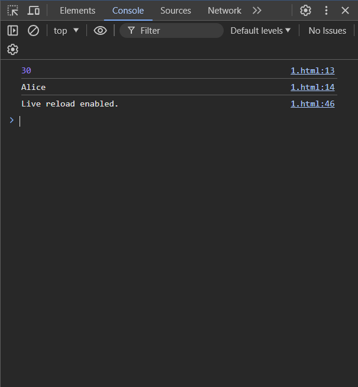
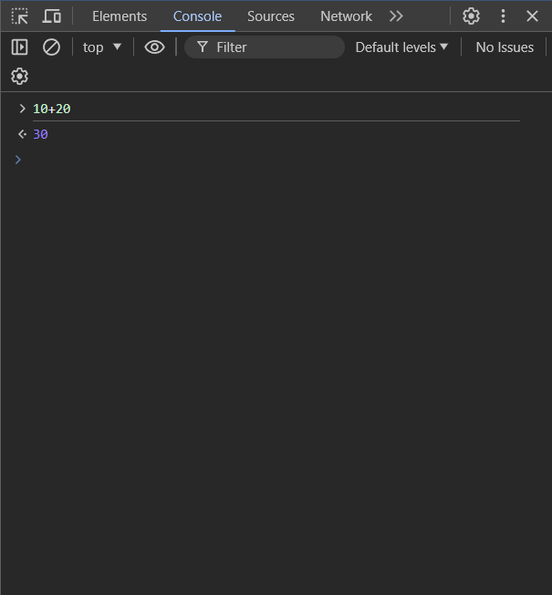
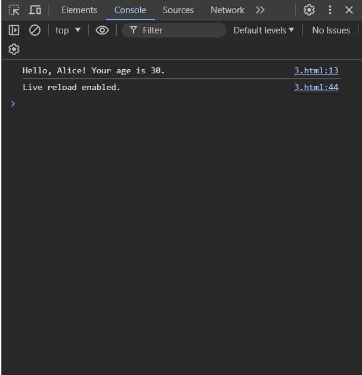
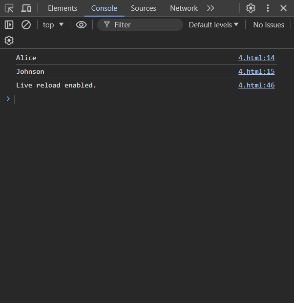
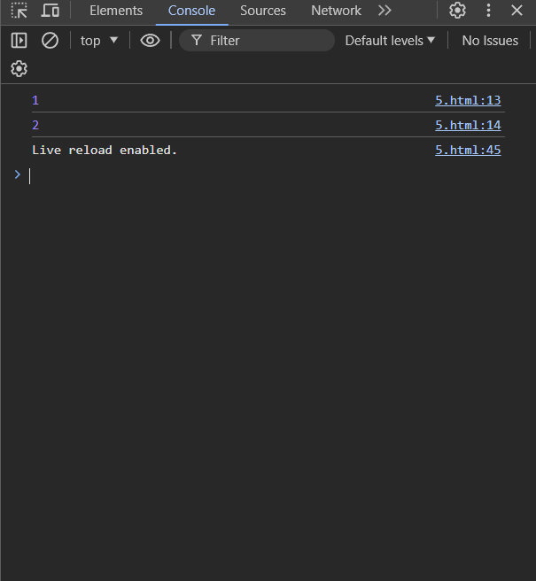
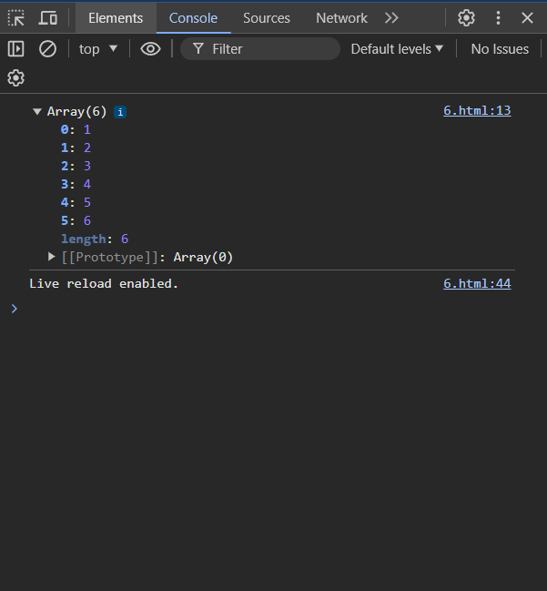
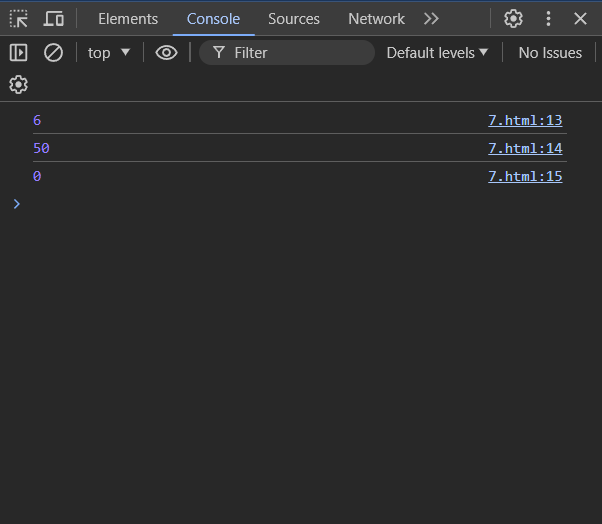
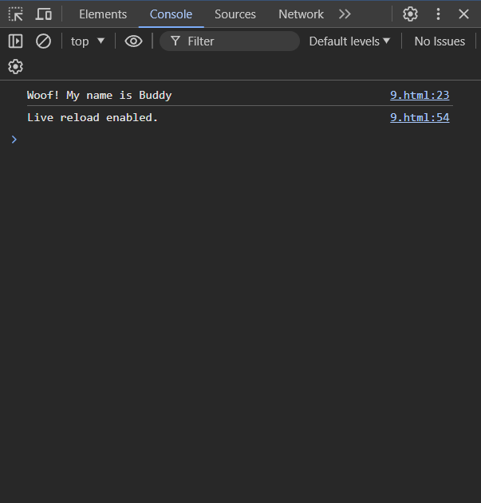
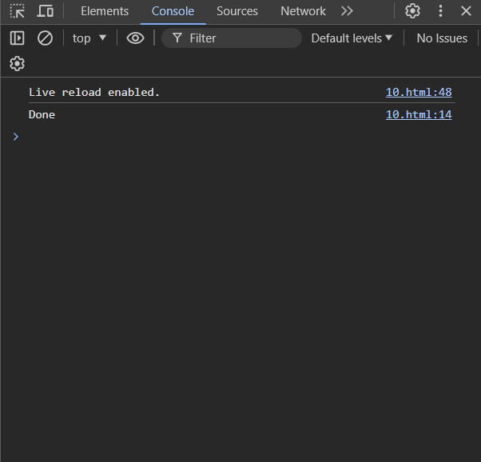

1.Let and Const
```
<!DOCTYPE html>
<html lang="en">
<head>
    <meta charset="UTF-8">
    <meta name="viewport" content="width=device-width, initial-scale=1.0">
    <title>Document</title>
</head>
<body>
    <script>
        let age = 30; 
        const name = "Alice"; 
        //name = "Bob"; 
        console.log(age)
        console.log(name); 

    </script>
    
</body>
</html>
```
2.Arrow Functions
````
<!DOCTYPE html>
<html lang="en">
<head>
    <meta charset="UTF-8">
    <meta name="viewport" content="width=device-width, initial-scale=1.0">
    <title>Document</title>
</head>
<body>
    <script>
        const add = (a, b) => a + b;
    </script>
</body>
</html>
````
3.Template Literals
```
<!DOCTYPE html>
<html lang="en">
<head>
    <meta charset="UTF-8">
    <meta name="viewport" content="width=device-width, initial-scale=1.0">
    <title>Document</title>
</head>
<body>
    <script>
        const name = "Alice";
        const age = 30;

        console.log(`Hello, ${name}! Your age is ${age}.`);

    </script>
</body>
</html>
```
4.Destructuring Objects
```
<!DOCTYPE html>
<html lang="en">
<head>
    <meta charset="UTF-8">
    <meta name="viewport" content="width=device-width, initial-scale=1.0">
    <title>Document</title>
</head>
<body>
    <script>
        const person = { firstName: "Alice", lastName: "Johnson" };

        const { firstName, lastName } = person;

        console.log(firstName); 
        console.log(lastName); 

    </script>
</body>
</html>
```
5.Destructuring Arrays
```
<!DOCTYPE html>
<html lang="en">
<head>
    <meta charset="UTF-8">
    <meta name="viewport" content="width=device-width, initial-scale=1.0">
    <title>Document</title>
</head>
<body>
    <script>
        const numbers = [1, 2, 3, 4, 5];

        const [first, second] = numbers;
        console.log(first); 
        console.log(second);

    </script>
</body>
</html>
```
6.Spread Operator
```
<!DOCTYPE html>
<html lang="en">
<head>
    <meta charset="UTF-8">
    <meta name="viewport" content="width=device-width, initial-scale=1.0">
    <title>Document</title>
</head>
<body>
    <script>
        const arr1 = [1, 2, 3];
        const arr2 = [4, 5, 6];
        const combined = [...arr1, ...arr2];
        console.log(combined);

    </script>
</body>
</html>
```
7.Rest Parameters
```
<!DOCTYPE html>
<html lang="en">
<head>
    <meta charset="UTF-8">
    <meta name="viewport" content="width=device-width, initial-scale=1.0">
    <title>Document</title>
</head>
<body>
    <script>
        const sum = (...numbers) => {
            return numbers.reduce((acc, current) => acc + current, 0);
        };
        console.log(sum(1, 2, 3)); 
        console.log(sum(5, 10, 15, 20)); 
        console.log(sum()); 

    </script>
</body>
</html>
```
8. Default Parameters
```
<!DOCTYPE html>
<html lang="en">
<head>
    <meta charset="UTF-8">
    <meta name="viewport" content="width=device-width, initial-scale=1.0">
    <title>Document</title>
</head>
<body>
    <script>
        const greet = (name, greeting = "Hello") => `${greeting}, ${name}!`;
        console.log(greet("Alice"));
        console.log(greet("Bob", "Hi")); 

    </script>
</body>
</html>
```
9.Classes and Inheritance
```
<!DOCTYPE html>
<html lang="en">
<head>
    <meta charset="UTF-8">
    <meta name="viewport" content="width=device-width, initial-scale=1.0">
    <title>Document</title>
</head>
<body>
    <script>
        class Animal {
  constructor(name) {
    this.name = name;
  }
}

class Dog extends Animal {
  bark() {
    return `Woof! My name is ${this.name}`;
  }
}

const myDog = new Dog("Buddy");
console.log(myDog.bark()); 

    </script>
</body>
</html>
```
10.Promises and Async/Await
```
<!DOCTYPE html>
<html lang="en">
<head>
    <meta charset="UTF-8">
    <meta name="viewport" content="width=device-width, initial-scale=1.0">
    <title>Document</title>
</head>
<body>
    <script>
        const waitAndReturn = () => new Promise(resolve => setTimeout(() => resolve("Done"), 2000));

async function run() {
  const result = await waitAndReturn();
  console.log(result);
}

run();

    </script>
</body>
</html>

```

Output:











